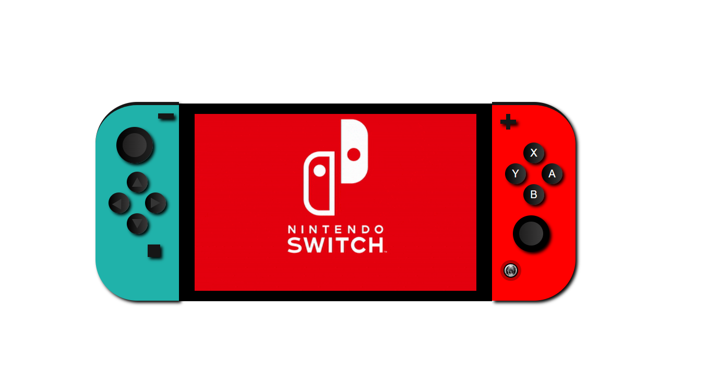
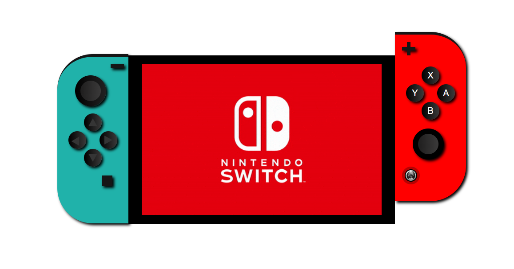

## Nintendo Switch

:wave: I'm Raquel Moya. 
:computer: I'm a FSD student at <kbd>⇥</kbd>  

### About the proyect

This project consists in reproducing the frontal image of a game console :video_game:. In this case, it is the Nintendo Switch.

First, you can see the frontal image of the Nintendo Switch:

And now you can see the front image of the Nintendo Switch when the mouse is over the controllers, in this case the right controller.
You can see that the screen is reproducing a GIF.

### Built with

For this, the following technologies have been used: 

 

You can see this project at <kbd>⇥</kbd> [GitHub pages](https://raquelmoya.github.io/proyectoNintendoCSS/ "GitHub pages")

### Credits

Author: RaquelMoya

Last edited on: 23/01/2022